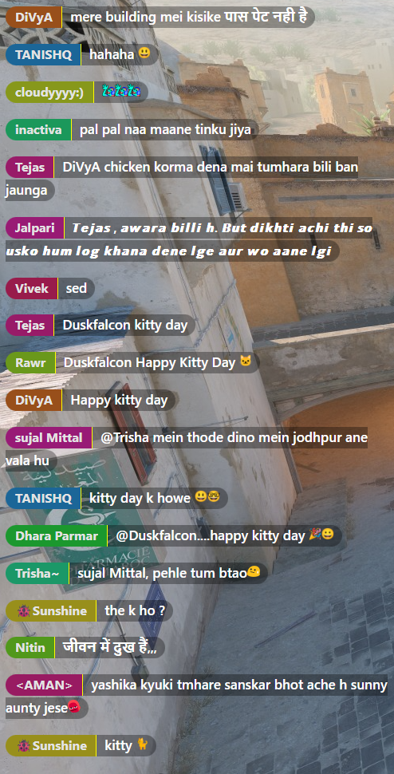
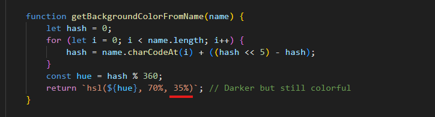
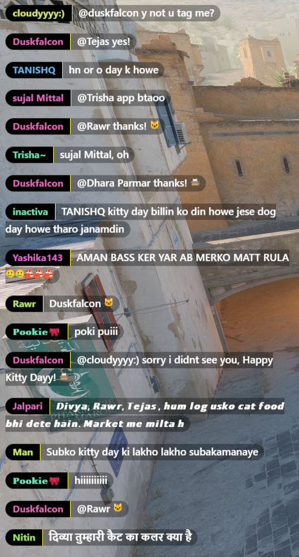
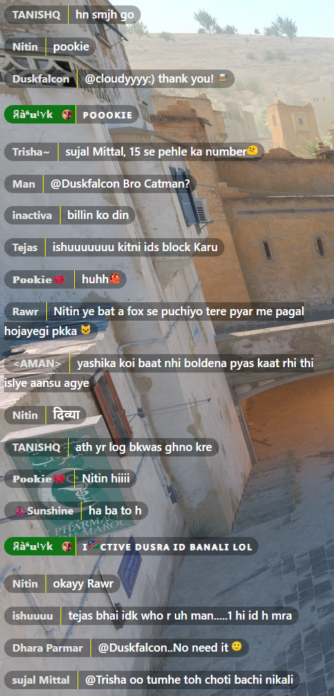
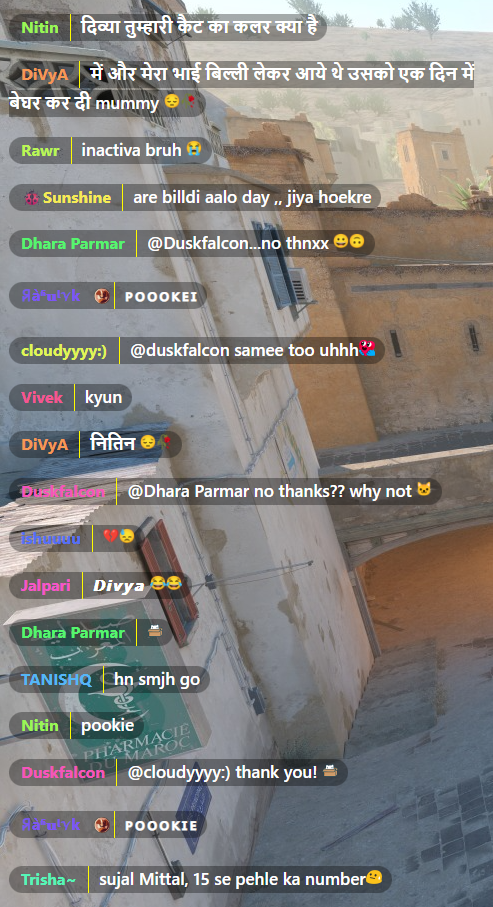
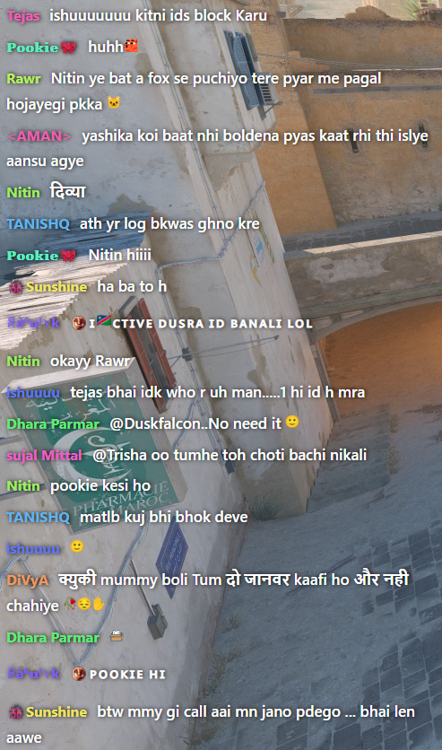
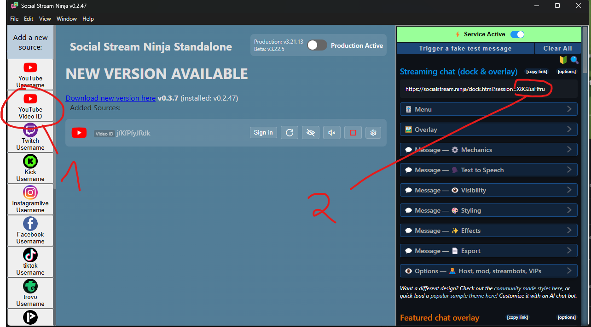
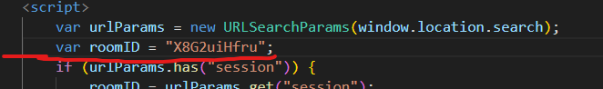
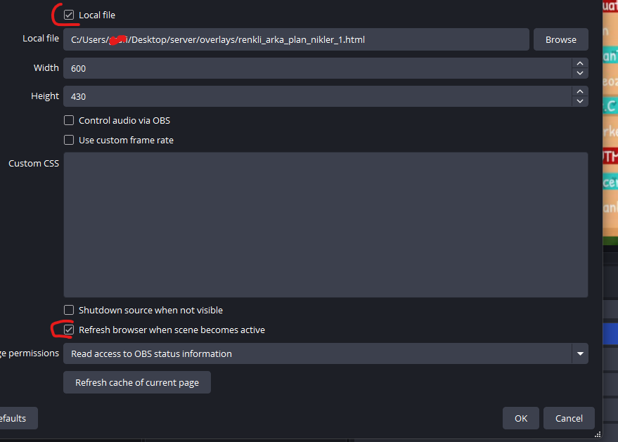

# Chat Overlay Nickname Styles

Bu projede, canlı sohbet sisteminizde kullanıcı takma adlarına dinamik renkler uygulamak için çeşitli HTML/CSS örnekleri sunulmaktadır.

## 🔥 Örnekler ve Önizlemeler

Aşağıdaki HTML dosyaları belirli bir görselle eşleşir:

### 1. Parlak renkli arka plan [`renkli_arka_plan_1.html`](overlays/renkli_arka_plan_1.html)

### Parlaklığı artırmak ve ya azaltmak için HTML dosyanın en sonunda `getBackgroundColorFromName` fonksiyonu var orada 35%-i değiştirin. Yukarı % daha parlak aşağısı daha az parlak.

---

### 2. [`siyah_arka_renkli_nikler.html`](overlays/siyah_arka_renkli_nikler.html)

### Parlaklığı artırmak ve ya azaltmak için HTML dosyanın en sonunda `getColorFromName` fonksiyonu var orada 65%-i değiştirin. Yukarı % daha parlak aşağısı daha az parlak.

### 3. [`youtube_kendi_renkleri.html`](overlays/youtube_kendi_renkleri.html)

### 4. [`sade_renkli_nikler.html`](overlays/sade_renkli_nikler.html)

### 5. [`arka_plansiz.html`](overlays/arka_plansiz.html)

### 4. Yeni overlay-lar eklene bilir...
> 📌 Görsel mevcut değildir.

---

## 🚀 Nasıl Kullanılır?

1. HTML dosyasını indirin.
2. Social Stream Ninja açın youtube id ekleyin. Activate source tıklayın.
3. Resimde gördüyünüz (2) url sonunda session id var onu kopyalayın.

4. `nodepad++` ve ya `Visual Studio Code` ile html dosyayı açın. ve orada roomID arayın.

5. Kopyaladığınız sessionid-yi buraya yapıştırın. Html dosyayı kaydedin.
6. Daha sonra OBS-ten Browser ekleyin. `Local file` kutusunu check edin ve html dosyayı seçin.
`Refresh browser when scene becomes active` kutusuna check etmekte fayda var. Html dosyada bir değişiklik yaptıkdan sonra göz ikonu ile browser-i gizleyib geri açarsanız değişiklikleri göre bilirsiniz.

---

