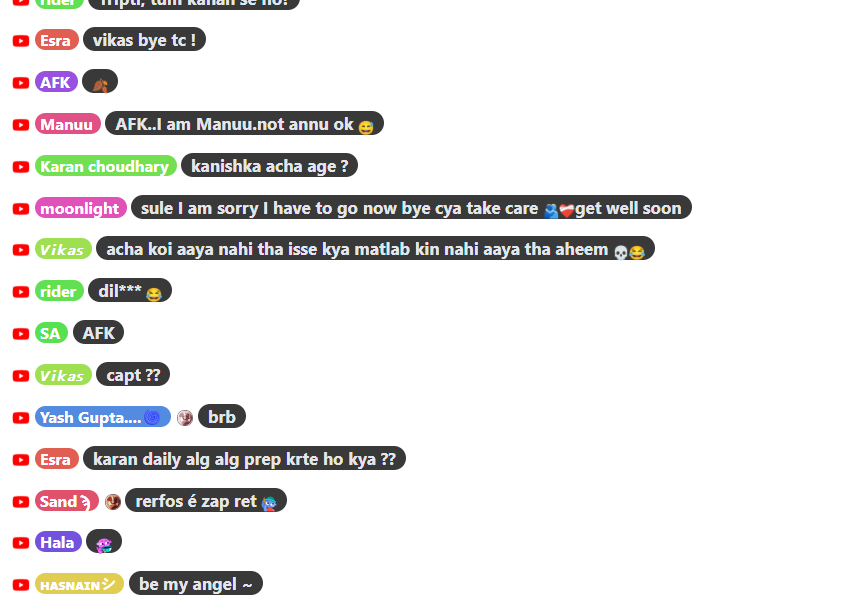
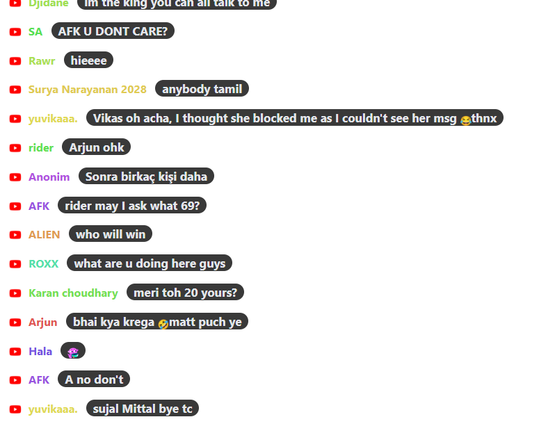

# Chat Overlay Nickname Styles

Bu projede, canlı sohbet sisteminizde kullanıcı takma adlarına dinamik renkler uygulamak için çeşitli HTML/CSS örnekleri sunulmaktadır.

## 🔥 Örnekler ve Önizlemeler

Aşağıdaki HTML dosyaları belirli bir görselle eşleşir:

### 1. [`colorful_bg_nick_with_text_bg.html`](overlays/colorful_bg_nick_with_text_bg.html)

---

### 2. [`colorful_nick_with_text_bg.html`](overlays/colorful_nick_with_text_bg.html)

---

### 3. [`colorful_consistent_to_names.html`](overlays/colorful_consistent_to_names.html)

> 📌 Bu dosya, takma ada göre tutarlı renk üretimini içerir. Görsel mevcut değildir.

---

## 🚀 Nasıl Kullanılır?

Lorem ipsum dolor sit amet, consectetur adipiscing elit. Sed non risus. Suspendisse lectus tortor, dignissim sit amet, adipiscing nec, ultricies sed, dolor.  
Cras elementum ultrices diam. Maecenas ligula massa, varius a, semper congue, euismod non, mi.

1. HTML dosyasını açın.
2. `nickname` değerini dinamik olarak verin.
3. Gerekiyorsa stil ve yapıyı özelleştirin.

---

