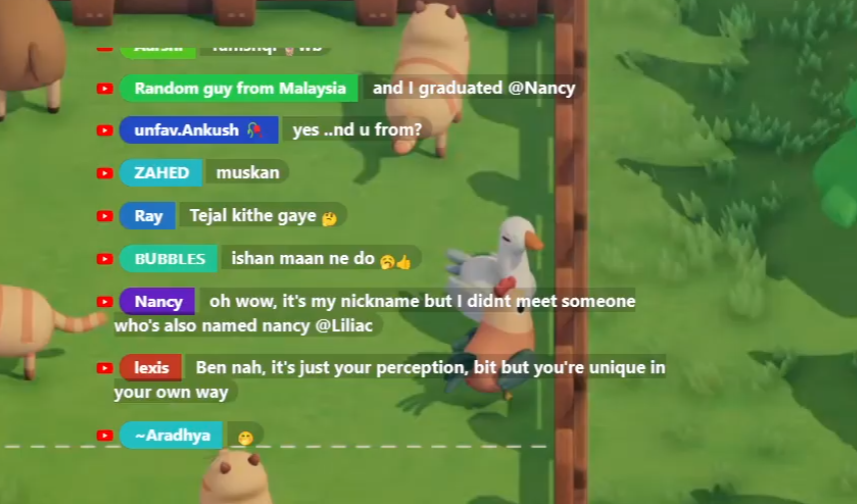

# Chat Overlay Nickname Styles

Bu projede, canlı sohbet sisteminizde kullanıcı takma adlarına dinamik renkler uygulamak için çeşitli HTML/CSS örnekleri sunulmaktadır.

## 🔥 Örnekler ve Önizlemeler

Aşağıdaki HTML dosyaları belirli bir görselle eşleşir:

### 1. [`renkli_arka_plan_nikler_1.html`](overlays/renkli_arka_plan_nikler_1.html)

---

### 2. [`colorful_consistent_to_names.html`](overlays/colorful_consistent_to_names.html)

> 📌 Bu dosya, takma ada göre tutarlı renk üretimini içerir. Görsel mevcut değildir.

---

## 🚀 Nasıl Kullanılır?

Lorem ipsum dolor sit amet, consectetur adipiscing elit. Sed non risus. Suspendisse lectus tortor, dignissim sit amet, adipiscing nec, ultricies sed, dolor.  
Cras elementum ultrices diam. Maecenas ligula massa, varius a, semper congue, euismod non, mi.

1. HTML dosyasını indirin.
2. Social Stream Ninja açın youtube id ekleyin. Activate source tıklayın.
3. Resimde gördüyünüz (2) url sonunda session id var onu kopyalayın.

4. `nodepad++` ve ya `Visual Studio Code` ile html dosyayı açın. ve orada roomID arayın.

5. Kopyaladığınız sessionid-yi buraya yapıştırın. Html dosyayı kaydedin.
6. Daha sonra OBS-ten Browser ekleyin. `Local file` kutusunu check edin ve html dosyayı seçin.
`Refresh browser when scene becomes active` kutusuna check etmekte fayda var. Html dosyada bir değişiklik yaptıkdan sonra göz ikonu ile browser-i gizleyib geri açarsanız değişiklikleri göre bilirsiniz.

---

